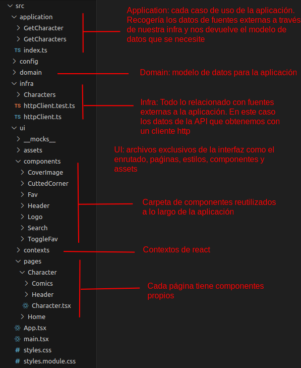
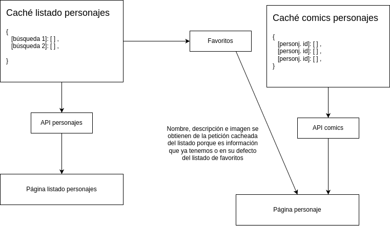

# Inditex Marvel

## Arquitectura

Construida con una arquitectura hexagonal usando React, React Context, Typescript, react-router, modulos de css y jest para los test.  
Configurado con eslint, prettier, husky y commitlint.

## Comportamiento filtros

En el listado normal el filtro se realiza contra la API apoyándose en una caché para la petición inicial y la búsqueda actual. Este filtro persiste después de navegar.  
En el listado de favoritos el filtro se realiza en local sobre el listado de personajes guardados. Este filtro no persiste después de navegar.

## Flujo de datos

1. Se hace una petición al API para obtener el listado.
2. El resultado se guarda en caché.
3. Navega al detalle de un personaje.
4. La información de la cabecera se obtiene de la caché del punto 2. O en su defecto, se obtiene del listado de favoritos. Esto es así porque primero se intenta recuperar de la caché de la última búsqueda relizada.
5. Se realiza otra petición para obtener los comics del personaje.
6. El listado de comics se guarda en caché.

## Navegación entre el listado inicial y los favoritos

Se diferencia entre un listado y otro a través de un parámetro en la url. También se podría guardar en el contexto de react qué modo está activo pero me he decantado por esta solución.

## Setup

Node: `v20.13.1`

`npm i`

Añadir un archivo `.env` en la raíz del proyecto con el campo `VITE_MARVEL_API_KEY=` con la api key
(Lo correcto sería un .env para cada entorno)

Además, la api key debe estar configurada para que se puedan hacer peticiones desde localhost.  
Esto se logra desde https://developer.marvel.com/account en la sección `Your authorized referrers`.

## Desarrollo

`npm run dev`

## Test

`npm run test`

Faltan test pero creo que con hacer unos cuantos es suficiente para este tipo de pruebas.

## Servir build de producción

`npm run build`

`npm run preview`

## Otros

La API va muy lenta y es posible que la petición falle y salga el error en consola.
